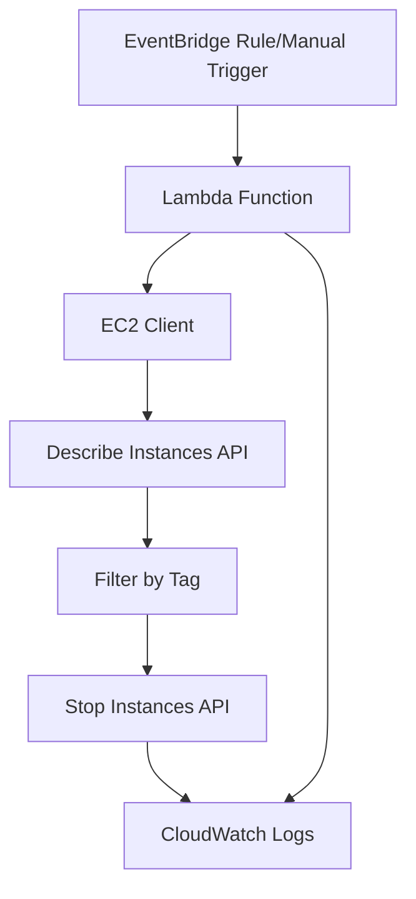

# Design Document

## Overview

The EC2 Auto-Shutdown Lambda function is a serverless solution that automatically stops EC2 instances based on tags. The function uses the AWS SDK to interact with EC2 services, implements robust error handling and retry logic, and provides comprehensive logging for operational visibility.

## Architecture



The architecture follows a simple event-driven pattern where:
- The Lambda function is triggered by EventBridge rules (scheduled) or manual invocation
- The function uses AWS SDK v3 for EC2 operations
- All operations are logged to CloudWatch Logs for monitoring and debugging

## Components and Interfaces

### Main Handler Function
- **Purpose**: Entry point for Lambda execution
- **Input**: Lambda event and context objects
- **Output**: Summary of shutdown operations
- **Responsibilities**: Orchestrate the shutdown process and handle top-level errors

### EC2 Service Module
- **Purpose**: Encapsulate EC2 API interactions
- **Methods**:
  - `getInstancesWithTag(tagKey, tagValue)`: Retrieve instances matching the shutdown tag
  - `stopInstance(instanceId)`: Stop a specific EC2 instance
- **Error Handling**: Implement retry logic with exponential backoff

### Configuration Module
- **Purpose**: Manage environment variables and default values
- **Configuration Items**:
  - `SHUTDOWN_TAG_KEY` (default: "AutoShutdown")
  - `SHUTDOWN_TAG_VALUE` (default: "yes")
  - `AWS_REGION` (automatically provided by Lambda runtime)

### Logger Module
- **Purpose**: Provide structured logging throughout the application
- **Log Levels**: INFO, WARN, ERROR
- **Log Format**: JSON structured logs for CloudWatch parsing

## Data Models

### Instance Information
```python
@dataclass
class InstanceInfo:
    instance_id: str
    state: str
    tags: Dict[str, str]
```

### Shutdown Result
```python
@dataclass
class ShutdownResult:
    instance_id: str
    success: bool
    error: Optional[str] = None
    previous_state: str = ""
```

### Function Response
```python
@dataclass
class LambdaResponse:
    status_code: int
    body: Dict[str, Any]  # Contains processedInstances, stoppedInstances, errors, summary
```

## Error Handling

### Retry Strategy
- **AWS API Throttling**: Exponential backoff with jitter (base delay: 1s, max delay: 30s, max retries: 5)
- **Network Errors**: Linear retry with 3 attempts and 2-second intervals
- **Permission Errors**: No retry, log error and continue with next instance

### Error Categories
1. **Recoverable Errors**: Throttling, temporary network issues
2. **Non-Recoverable Errors**: Permission denied, invalid instance ID
3. **Partial Failures**: Some instances fail while others succeed

### Logging Strategy
- Log all API calls with request/response details
- Log individual instance processing results
- Provide summary statistics at completion
- Use correlation IDs for request tracing

## Testing Strategy

### Unit Tests
- Test configuration loading with various environment variable scenarios
- Test EC2 service methods with mocked AWS SDK calls
- Test error handling and retry logic
- Test logging output format and content

### Integration Tests
- Test against real AWS services in a test environment
- Verify IAM permissions work correctly
- Test with various EC2 instance states and tag combinations
- Validate CloudWatch log output

### Performance Tests
- Test with large numbers of instances (100+)
- Verify Lambda timeout handling
- Test memory usage under load
- Validate retry behavior under throttling conditions

## Security Considerations

### IAM Permissions (Principle of Least Privilege)
```json
{
  "Version": "2012-10-17",
  "Statement": [
    {
      "Effect": "Allow",
      "Action": [
        "ec2:DescribeInstances",
        "ec2:StopInstances"
      ],
      "Resource": "*"
    },
    {
      "Effect": "Allow",
      "Action": [
        "logs:CreateLogGroup",
        "logs:CreateLogStream",
        "logs:PutLogEvents"
      ],
      "Resource": "arn:aws:logs:*:*:*"
    }
  ]
}
```

### Environment Variables
- No sensitive data stored in environment variables
- Configuration values are non-sensitive operational parameters
- AWS credentials managed automatically by Lambda execution role

## Deployment Considerations

### Lambda Configuration
- **Runtime**: Python 3.9 or later
- **Memory**: 256 MB (sufficient for EC2 API calls)
- **Timeout**: 5 minutes (allows processing of many instances)
- **Environment Variables**: SHUTDOWN_TAG_KEY, SHUTDOWN_TAG_VALUE

### Packaging
- Use boto3 (included in Lambda runtime) for AWS API interactions
- Include only necessary dependencies in deployment package
- Optimize for cold start performance with efficient imports

### Monitoring
- CloudWatch metrics for invocation count, duration, and errors
- Custom metrics for instances processed and stopped
- Alarms for function failures or unusual activity